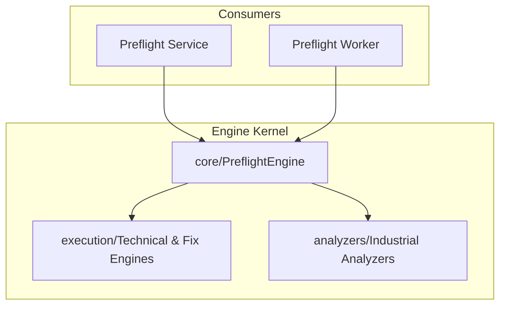

# PrintPrice OS — Preflight Engine (`ppos-preflight-engine`)

## 1. Repository Role
The `ppos-preflight-engine` is the **Deterministic Execution Kernel** and **Intelligence Layer** of PrintPrice OS. It contains the core industrial logic for PDF analysis, forensic verification, risk scoring, and automated corrections. It is designed as a stateless, highly resilient logic core embedded directly into higher-level execution contexts.

## 2. Phase 10 Diagnostic Contract (Intelligence Layer)
This engine adheres strictly to the **Phase 10 Preflight Diagnostic Contract**:
- **Truth Preservation**: Missing optional tools (like `mutool` or `qpdf`) degrade the analysis (`DEGRADED` or `PARTIAL`), but do NOT trigger a false environment failure (`FAILED_RUNTIME_ENVIRONMENT`) if a real `pdf-lib` extraction succeeds.
- **`fallbackUsed` Integrity**: Only set to `true` when actual fallback mocks are injected, `realExtraction` fails entirely, or a complete environment failure occurs. 
- **Explicit `outcome_category`**: Root-level status categories are injected (`SUCCESS`, `SUCCESS_WITH_FINDINGS`, `DEGRADED_ANALYSIS`, `PARTIAL_ANALYSIS`, `PDF_DOCUMENT_FAILURE`, `ENVIRONMENT_FAILURE`) to guarantee semantic consistency across the BFF, Worker, Service, and ControlPlane.
- **Evidence-Based Findings**: No issue is ever emitted without raw extraction evidence. 

## 3. Architecture Position
It is a "Leaf" repository that provides the logic used by `ppos-preflight-service` (sync/fast-path) and `ppos-preflight-worker` (async/heavy-lifting).



## 4. Required Industrial Probes
The engine integrates with several system-level CLI binaries to extract forensic PDF data:
- `pdfinfo` & `pdfimages` (Poppler)
- `pdffonts` (Poppler)
- `mutool` (MuPDF)
- `qpdf`
- `gs` (Ghostscript)

If critical probes are missing, the engine gracefully degrades the report and emits a `PARTIAL` or `DEGRADED` status with `missing_tools` populated, maintaining the integrity of the extraction.

## 5. Key Components
- **`core/`**: Central orchestrator (`PreflightEngine.js`) and normalization logic (`ReportBuilder.js`, `IssueNormalizer.js`).
- **`analyzers/`**: Specific feature extraction and verification (e.g., `ColorAnalyzer`, `GeometryAnalyzer`, `FontAnalyzer`, `OutputIntentAnalyzer`).
- **`execution/`**: Native shell interactions and technical orchestration (`PdfTechnicalEngine.js`, `AutofixExecutionEngine.js`, `PdfFixEngine.js`).
- **`fixes/`**: Planners and strategies for non-destructive PDF repair (`FixPlanner.js`).
- **`tests/`**: Comprehensive regression suite (`regression-suite.js`) validating the Phase 10 contract.

## 6. Local Development

### Installation
```bash
npm install
```

### Regression Testing
```bash
npm test
# Or run the regression suite directly:
node tests/regression-suite.js
```

### Usage (as a module)
```javascript
const { createStandardEngine } = require('ppos-preflight-engine');

const engine = createStandardEngine();
const result = await engine.analyzePdf('my_asset.pdf', { 
    policy: 'OFFSET_MODERN_COATED_F51',
    strict_forensic_mode: true 
});

console.log(`Risk Score: ${result.risk_score}`);
console.log(`Outcome Category: ${result.outcome_category}`);
```

## 7. Version Baseline
**Current Version**: `v1.9.0-deterministic` (Phase 10 Intelligence Layer)

---
© 2026 PrintPrice. Distributed Execution Infrastructure.