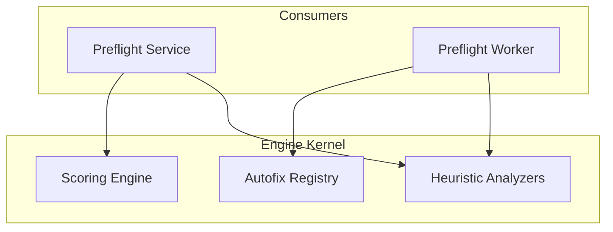

# PrintPrice OS — Preflight Engine (`ppos-preflight-engine`)

## 1. Repository Role
The `ppos-preflight-engine` is the **Deterministic Execution Kernel** of the PrintPrice OS. It contains the core industrial logic for PDF analysis, scoring, and correction. It is designed as a stateless logic core that can be embedded or executed in isolation.

## 2. Architecture Position
It is a "Leaf" repository that provides the logic used by the `preflight-service` (sync calls) and the `preflight-worker` (async jobs).



## 3. Responsibilities
- **Industrial Scoring**: Calculating risk scores (0-1.0) for print production.
- **Autofix Registry**: Library of correction strategies (Bleed expansion, Color normalization, Font embedding).
- **PDF Heuristics**: Deterministic detection of overprints, transparency issues, and resolution violations.
- **FEP Compliance**: Ensuring all analysis results comply with the Federated Execution Protocol (FEP).

## 4. Key Components
- **`scoring/`**: Algorithms for printability assessment.
- **`autofix/`**: Implementations for PDF modification and correction.
- **`heuristics/`**: Low-level PDF structure verification.

## 5. Dependency Relationships
- **Embedded In**: Required as a module by `ppos-preflight-service` and `ppos-preflight-worker`.
- **Infrastructure**: Minimal dependencies, focus on pure computational logic.

## 6. Local Development

### Installation
```bash
npm install
```

### Usage (as a module)
```javascript
const engine = require('@ppos/preflight-engine');

const result = await engine.analyze('my_asset.pdf', { policy: 'HIGH_STAKE' });
console.log(`Risk Score: ${result.score}`);
```

## 7. Version Baseline
**Current Version**: `v1.9.0` (Federated Health & Decoupling Pass)

---
© 2026 PrintPrice. Distributed Execution Infrastructure.